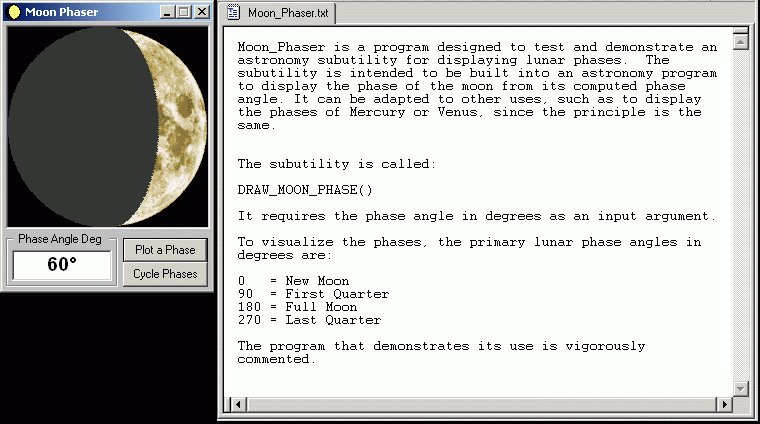



## Moon\_Phaser

### Description

Sub utility for displaying an image of the moon as viewed from a given phase angle.
 
### More Info
 
Phase angle in degrees

This program tests and demonstrates a subutility for displaying the phase of the moon corresponding to a given phase angle in degrees.

It is intended to be built into an astronomy program for the purpose of displaying the lunar phase using the computed phase angle as its input argument.

Lunar image shaded according to the given phase angle.

             |
---                |---
**Submitted On**   |2001-08-19 14:52:20
**By**             |[Jay Tanner](https://github.com/Planet-Source-Code/PSCIndex/blob/master/ByAuthor/jay-tanner.md)
**Level**          |Intermediate
**User Rating**    |4.7 (14 globes from 3 users)
**Compatibility**  |VB 6\.0
**Category**       |[Graphics](https://github.com/Planet-Source-Code/PSCIndex/blob/master/ByCategory/graphics__1-46.md)
**World**          |[Visual Basic](https://github.com/Planet-Source-Code/PSCIndex/blob/master/ByWorld/visual-basic.md)
**Archive File**   |[Moon\_Phase249428192001\.zip](https://github.com/Planet-Source-Code/jay-tanner-moon-phaser__1-26380/archive/master.zip)

